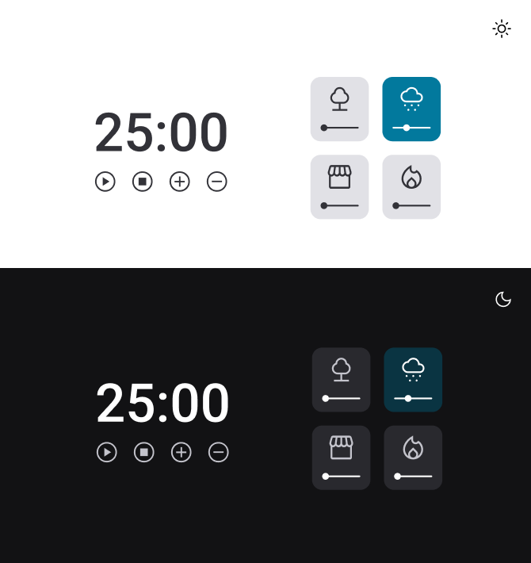

<h1 align="center"> Stage 5 - Avançando no JavaScript - Exercício - Focus Timer 2.0 - DARK MODE 🕜 </h1>

  <a href="#-tecnologias">Tecnologias</a>&nbsp;&nbsp;&nbsp;|&nbsp;&nbsp;&nbsp;
  <a href="#-projeto">Projeto</a>&nbsp;&nbsp;&nbsp;|&nbsp;&nbsp;&nbsp;
  <a href="#-layout">Layout</a>&nbsp;&nbsp;&nbsp;|&nbsp;&nbsp;&nbsp;
  <a href="#memo-licença">Licença</a>

 

  

## 🚀 Tecnologias

Esse projeto foi desenvolvido com as seguintes tecnologias:

- HTML e CSS
- Java Script
- Git e Github
- Figma

## 💻 Projeto

 
Cada card que se encontra do lado direito, quando selecionado, vai mudar de cor e emitir um som diferente:

  - Floresta
  - Chuva
  - Cafeteria
  - Lareira

Funcionalidades esperadas dos botões:

- Play:   Aciona o timer;
- Stop:   Para o timer;
- Mais:   Aumenta em mais 5 minutos o tempo do timer;
- Menos:  Diminui em 5 minutos o tempo do timer.

Botão Alterar Tema:

- Ao clicar no botão o mesmo altera o tema para DARK MODE

Novas Funcionalidade de um card: 
Quando um card é selecionado ele muda de cor e começa a tocar o som específico, certo? 
Nessa versão, além disso, o volume deverá ser controlado pelo slider que está embaixo de cada ícone.
Obs: por padrão, quando você clicar em qualquer área de um card, você pode deixar o volume em 50%.
  
Diferencial feito nesse projeto, foi que caso ocorra pause e o display segundos cair em qualquer número que não seja a primeira casa decimal diferente de 0 ou 5, ao encrementar a lógica do programa corrigi automáticamente para o encremento em 5 e 5 segundos.

Exemplo:
Caso ocorra o pause em 14 segundos, ao encrementar em + 5, o encremento seria 19, porém o sistema ajusta, para 15, ocorrendo o encremento em 5 e 5 da primeira casa decimal.
E a mesma lógica ocorre para o decremento.

  Nesse desafio foi desenvolvido as seguintes habilidades voltadas a programação com JS e manipulação da DOM:
  
  - Programação Iperativa
  - Programação Declarativa
  - novas métodos DOM
  - Recursão de funções
  - Padrão Factory ( Organização código)
  - Manipulação de aúdio

## 🔖 Layout

Você pode visualizar o layout do projeto através [DESSE LINK](<https://www.figma.com/file/jrwGpe4IEmkoWm4cmrsmb0/Stage-05---Dark-Mode-FocusTimer-(Copy)?node-id=0-1&t=NQPJNv6heCihtu5W-0>). É necessário ter conta no [Figma](https://figma.com) para acessá-lo.

## :memo: Licença

Esse projeto está sob a licença MIT.

---

Feito com  ♥  by Alex Lima

Você pode acessar o Website do projeto através do link: 
<a href= "https://A1exLima.github.io/rocketseat-stage5-exercicio-focus-timer-2.0-dark-mode/" target="_blank"> Clique aqui ⏯ </a>

